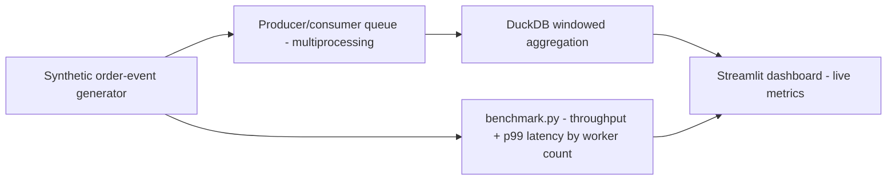

# ⚡ Order Pulse

A synthetic grocery order-event pipeline: generate events → parallel feature processing → DuckDB bulk load → windowed operational metrics (late-delivery rate, substitution rate) by store and category — plus a real, measured throughput/latency benchmark across worker counts.

**Problem:** most portfolio "data pipeline" projects are a notebook that runs once. This one has an actual performance story with numbers measured on this machine, not invented:

| Mode | Workers | Events/sec | p50 latency | p99 latency |
|---|---|---|---|---|
| Sequential | 1 | 3,194 | 0.30 ms | 0.92 ms |
| Multiprocessing | 2 | 4,230 | 0.32 ms | 1.38 ms |
| Multiprocessing | 4 | 6,813 | 0.34 ms | 0.92 ms |
| Multiprocessing | 8 | 7,273 | 0.41 ms | 2.02 ms |

~2.3x throughput on an 8-core machine going from 1 to 8 workers — sublinear, as expected once IPC/pickling overhead and per-core contention start to bite, not a fabricated linear-scaling claim. Reproduce with `python benchmark.py`.

## How it works



- **`event_generator.py`** — synthetic order events (store, category, item count, late/substitution flags) with category-specific base risk rates so the data isn't uniform noise.
- **`pipeline.py`** — `process_event()` runs a deliberately non-trivial per-event feature computation (standing in for real-world parsing/enrichment cost), tuned so multiprocessing genuinely pays off rather than being dominated by IPC overhead. **A real correctness detail:** the DuckDB load uses `INSERT INTO events BY NAME` rather than a positional `SELECT *` — an earlier version used positional insert and silently swapped two columns because the processed-event dict's key order didn't match the table schema exactly; caught by testing against real output, not assumed correct.
- **Why DuckDB is loaded once, not concurrently:** DuckDB supports one writer process at a time. Parallelism here is applied to the CPU-bound *processing* stage (across a `multiprocessing.Pool`), with a single fast bulk insert once processing completes — both the correct approach and the realistic shape of a real pipeline (parallel transform, single-writer load).
- **`benchmark.py`** — standalone script measuring real throughput and p50/p99 latency across worker counts; the dashboard's benchmark tab runs it as a subprocess rather than calling `multiprocessing.Pool` directly inside the Streamlit process, since `spawn`-based multiprocessing doesn't reliably work inside Streamlit's script-execution model on macOS/Windows.

## Run it locally

```bash
pip install -r requirements.txt
streamlit run app.py
```

Or run the benchmark directly: `python benchmark.py --events 20000`

## Stack

Streamlit · DuckDB · multiprocessing · pandas · NumPy · Plotly

---
Portfolio project. All event data is synthetic.
